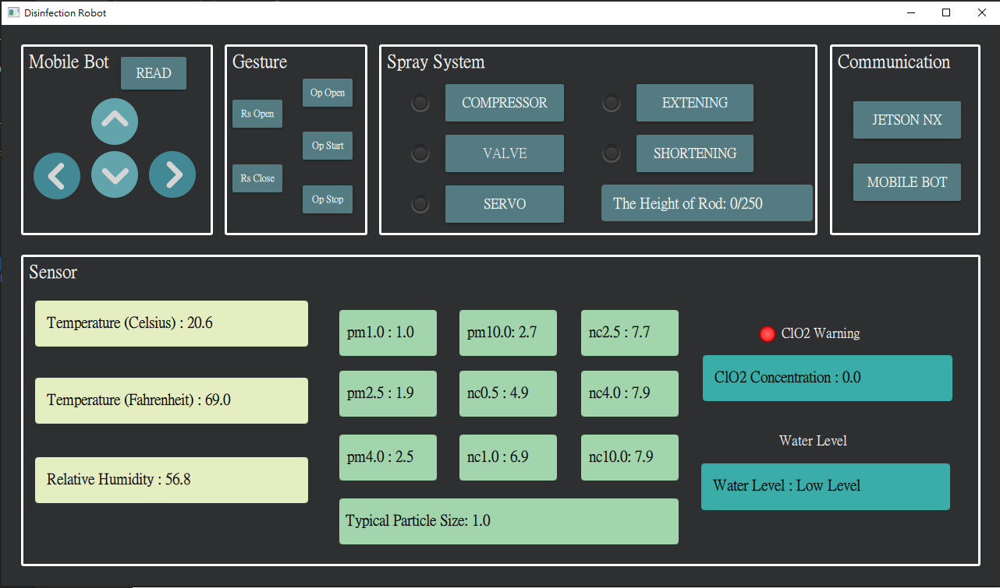

# Remote GUI for Disinfection Robot

 

The code includes a Socket client. After connecting to the server, the UI will show datas from the server (the robot), and users can control the robot by buttons. 